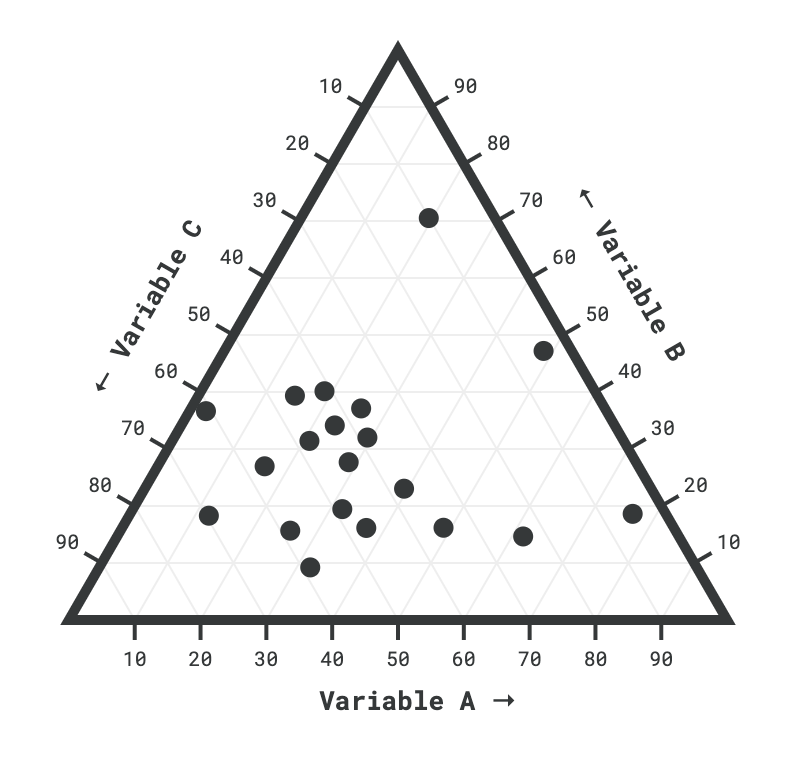

# ternary-plot


Web component to implement a ternary plot.

<div align="center">



</div>


## Usage

In an html file

```html
<!DOCTYPE html>
<html>
  <head>
    <script type="module">
      import 'https://unpkg.com/ternary-plot@latest/dist/ternary-plot.umd.js';
    </script>
  </head>
  <style>
    @import url('https://fonts.googleapis.com/css?family=Roboto+Mono:400,700&display=swap');
    /*
      CSS custom properties penetrate the Shadow DOM,
      they are useful to provide custom styling.
      The ternary-plot webcomponent exposes font-size and font-family custom properties.
    */
    ternary-plot {
      --font-size: 13px;
      --font-family: 'Roboto Mono', monospace;
    }
  </style>
  <body>
    <ternary-plot side="400"></ternary-plot>
  </body>
  <script>
    const element = document.querySelector('ternary-plot');
    // Set data as a dynamic property.
    element.data = {
      titles: {
        bottom: "Variable A",
        right: "Variable B",
        left: "Variable C",
      },
      data: [
        {
          bottom: 0.3,
          right: 0.4,
          left: 0.3
        },
        {
          bottom: 0.1,
          right: 0.5,
          left: 0.4
        },
      ]
    };
  </script>
</html>
```

With npm:

```
npm i ternary-plot
```

See [demo](https://stackblitz.com/edit/ternary-plot-example).

## License

MIT
